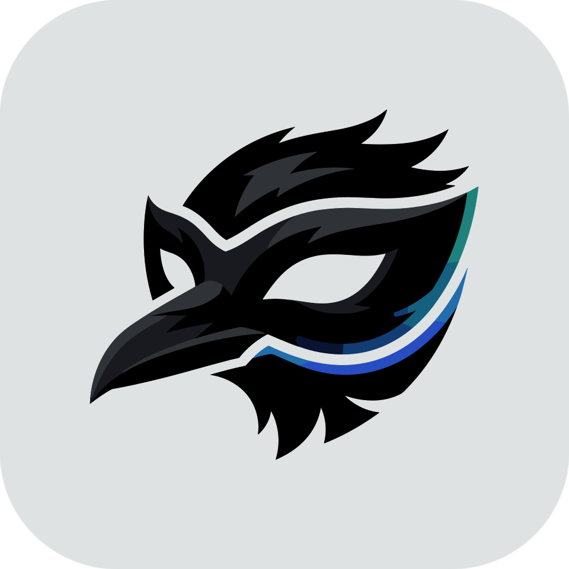

# Raven Chromium

A source-level fingerprint-spoofing **Chromium fork** (target milestone 150). Open source. Produces a **persistent, coherent synthetic device identity per profile** for multi-account / e-commerce use — spoofing fingerprints natively in the C++ engine (no detectable JS shim), unlike runtime-injection approaches.

The `Raven Chromium` name lives in the repo / build / CLI only — the running browser identifies as **real Chrome** (that's the whole point), so the name never leaks into the fingerprint.

- **Spec:** [`docs/chromium-fingerprint-build-spec.md`](docs/chromium-fingerprint-build-spec.md)
- **Baseline:** ungoogled-chromium-150 + fingerprint patches (fingerprint-chromium persistence model + Brave farbling coverage)
- **License:** BSD-3-Clause (see [`LICENSE`](LICENSE)) for this repo's code; vendored files keep their upstream headers — `farbling_prng.h` MPL-2.0, `siphash.*` CC0.
- **Consumer contract:** `--fingerprint-profile=<json>` + switch set + a real-device descriptor schema.

---

<div align="center">



<h2>MaskRaven&nbsp;·&nbsp;隐鸦</h2>

<sub><em>yǐn yā — "stealth raven"</em></sub>

**The multi-profile control plane for Raven Chromium.**

[](https://maskraven.com)

</div>

**MaskRaven** is the **cockpit**: a security-hardened, cross-platform desktop app (Windows · macOS · Linux) that drives fleets of Raven Chromium profiles — each with its own real-device persona, proxy, cookies, and logins.

- **Multi-profile fleets** — launch and manage many isolated profiles; each pins a coherent real-device fingerprint persona, bound stably to the profile across runs.
- **Embedded proxy** — per-profile xray-core (vmess · vless/reality · trojan · shadowsocks · socks) runs in-process: no spawned binary, no on-disk config.
- **Hardened by design** — no localhost UI server; secrets sealed with AES-256-GCM behind the OS keychain; verified engine downloads (signed manifest → SHA-256 → OS code-signature).
- **Guard, backups & automation** — a credential vault with cross-profile sharing, encrypted export/import, and an off-by-default authenticated local API.

<div align="center"><sub>MaskRaven is a commercial product · Raven Chromium is and stays open source · <a href="https://maskraven.com">maskraven.com</a></sub></div>

---

## Build

Builds on a Linux x64 host with `depot_tools` and a synced ungoogled-chromium-150 tree (see [`build/PINS`](build/PINS)). Three scripts — fetch, apply the patch series onto the `raven-base` baseline, then compile:

```bash
build/sync.sh                                # fetch/sync the pinned Chromium tree
build/apply-patches.sh                       # apply the Raven patch series (reads $CHROMIUM_SRC)
PLATFORM=linux-x64 build/gen-and-build.sh    # gn gen + autoninja → out/Default/chrome
```

Reference CI flow: [`.github/workflows/build-linux.yml`](.github/workflows/build-linux.yml). Full plans, contract, and packaging docs: [`docs/`](docs/).

## Usage

```bash
out/Default/chrome --fingerprint-profile=<descriptor.json> --user-data-dir=<dir>
```

The browser then presents the descriptor's device identity — **byte-identical across restarts** for a given profile. Sample personas live in [`profile-db/personas/`](profile-db/personas/); the descriptor schema + validator are in [`profile-db/`](profile-db/).

## Credits

Built on the work of:

- **[ungoogled-chromium](https://github.com/ungoogled-software/ungoogled-chromium)** — the de-Googled Chromium baseline this fork patches.
- **[fingerprint-chromium](https://github.com/adryfish/fingerprint-chromium)** (adryfish) — the fingerprint-spoofing approach and persistence model this patch series extends.

Vendored primitives retain their upstream licenses (see the **License** note above and [`third_party/lifted/`](third_party/lifted/)).
